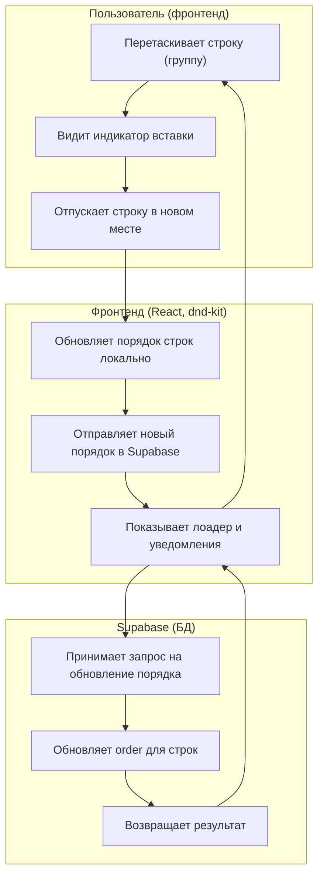

Дата: 01.10.2025 Улучшено отображение дат и добавлена функция очистки в компоненте Datepicker

Описание: Исправлена логика отображения выбранных дат в компоненте `Datepicker.tsx`. Теперь, если выбрана только одна дата (начальная дата диапазона), отображается именно эта дата, а не текст-заглушка "Выберите даты". Добавлена функция `formatDateRu` для форматирования одной даты и функция `getDateButtonText` для получения текста кнопки. Логика работает следующим образом: при наличии обеих дат отображается диапазон дат, при наличии только начальной даты - только она, при отсутствии выбранных дат - текст-заглушка. Вложенные тернарные операторы заменены на явные if-условия для улучшения читаемости кода. Добавлена кнопка очистки даты с иконкой крестика (XIcon), которая отображается только при наличии выбранной даты. Обработчик очистки предотвращает открытие календаря и сбрасывает выбранную дату. Адаптированы все формы для работы с новой логикой Datepicker: в `ReserveInfo.tsx` исправлена работа с полем `date` типа `[Date, Date]`, в `SearchForm.tsx` и `Search.tsx` обновлена логика обработки выбора дат для поддержки частичного выбора диапазона.

Дата: 01.10.2025 Оптимизирована загрузка календарей и добавлены карточки Shadcn

Описание: Проведена оптимизация страницы бронирования (`src/app/main/reservation/page.tsx`). Убрана виртуализация календарей с использованием `@tanstack/react-virtual` и заменена на простой скролл с подгрузкой новых данных. Добавлены карточки Shadcn UI для каждого календаря отеля с заголовком и содержимым. Реализован обработчик скролла `handleScroll` с подгрузкой новых данных при приближении к концу списка (за 100px до конца). Улучшена производительность за счёт упрощения рендеринга - теперь все календари отображаются в обычном списке с фиксированной высотой контейнера (600px) и вертикальным скроллом. Сохранена вся функциональность бесконечной подгрузки данных через `useInfiniteHotelsQuery`.

Дата: 01.10.2025 Исправлен порядок отображения лоадера в Calendar компоненте

Описание: Исправлена критическая проблема с порядком отображения лоадера в компоненте `Calendar.tsx`. Проблема заключалась в том, что проверка пустоты данных (`isEmpty`) выполнялась до проверки состояния загрузки (`isLoading`), что приводило к возврату `null` во время загрузки вместо показа лоадера. Исправлена логика: теперь сначала проверяется состояние загрузки и показывается `FullWidthLoader`, а только после завершения загрузки проверяется наличие данных. Оптимизирован `useEffect` - убрано дублирование запросов (`refetch()` и `invalidateQueries` одновременно). Исправлена типизация в модальных окнах `RoomModal` и `ReserveModal` для корректной работы с типами `Room` и `Reserve`. Теперь лоадер корректно отображается во время загрузки данных календаря.

Дата: 01.10.2025 Исправлено позиционирование выпадающего списка в MultipleSelector

Описание: Исправлена проблема с позиционированием выпадающего списка в компоненте `MultipleSelector.tsx`. Проблема заключалась в том, что выпадающий список отображался в общем потоке DOM и увеличивал высоту модального окна. Реализовано решение с использованием React Portal (`createPortal`) для вывода выпадающего списка из потока DOM. Добавлено отслеживание позиции инпута с помощью `getBoundingClientRect()` для корректного позиционирования списка под инпутом. Реализованы обработчики событий для обновления позиции при скролле и изменении размера окна. Выпадающий список теперь использует `fixed` позиционирование с динамически вычисляемыми координатами. Это решение полностью устраняет влияние выпадающего списка на высоту модального окна и обеспечивает корректное отображение во всех случаях.

Дата: 01.10.2025 Исправлены проблемы с взаимодействием в MultipleSelector

Описание: Исправлены критические проблемы с взаимодействием в компоненте `MultipleSelector.tsx` после внедрения портала. Проблема заключалась в том, что выпадающий список закрывался при клике на элементы из-за неправильной обработки событий клика вне области. Исправлен обработчик `handleClickOutside` для корректной работы с порталом - теперь он проверяет клики как внутри инпута, так и внутри выпадающего списка через `data-command-list` селектор. Исправлена функция `updateDropdownPosition` для использования `dropdownRef` вместо `inputRef`, что обеспечивает корректную ширину списка, соответствующую всему контейнеру инпута. Добавлены обработчики `onMouseDown` для предотвращения всплытия событий. Исправлена типизация для `onSelect` обработчика. Теперь элементы списка корректно выбираются без закрытия выпадающего списка, а ширина списка точно соответствует ширине инпута.

Дата: 01.10.2025 Исправлена ошибка типизации в FormMultipleSelector

Описание: Исправлена ошибка типизации в компоненте `FormMultipleSelector.tsx`. Проблема заключалась в конфликте типов `Option` - в файле был определен локальный интерфейс `Option` с базовыми свойствами `value` и `label`, в то время как компонент `MultipleSelector` экспортирует расширенный тип `Option` с дополнительными свойствами `disable?` и индексной сигнатурой `[key: string]: string | boolean | undefined`. Исправлен импорт для использования экспортируемого типа `Option` из `multiple-selector.tsx` и удален локальный интерфейс. Теперь TypeScript ошибка "Type 'Option[]' is not assignable to type 'import(...).Option[]'" устранена, и типы полностью совместимы.

Дата: 01.10.2025 Исправлена ошибка типизации в Navbar компоненте

Описание: Исправлена ошибка типизации в компоненте `NavBar.tsx`. Проблема заключалась в несоответствии типов между store `$user` (тип `User | null`) и пропсом `user` в компоненте `Navbar` (тип `User | undefined`). Изменен тип пропса `user` в интерфейсе `NavbarProps` с `user?: User` на `user?: User | null` для совместимости с типом из Effector store. Код уже использовал optional chaining (`user?.`) для безопасного доступа к свойствам, поэтому дополнительных изменений не потребовалось. Теперь TypeScript ошибка "Type 'null' is not assignable to type 'User | undefined'" устранена.

Дата: 01.10.2025 Добавлено правильное склонение слова "номер" в HotelsTable

Описание: Добавлена функция для правильного склонения слова "номер" в зависимости от количества в компоненте `HotelsTable.tsx`. Создана функция `getRoomDeclension` которая определяет правильное окончание: "номер" (1), "номера" (2-4), "номеров" (5+), с учетом исключений для чисел от 11 до 19. Добавлена функция `getRoomsCountText` для получения строки с количеством и правильным окончанием. Исправлена незавершенная функция `getRoomsCount` в компоненте `HotelCard`. Заменены все места с неправильным окончанием "номеров" на использование новых функций склонения. Теперь в интерфейсе корректно отображается: "1 номер", "2 номера", "5 номеров", "11 номеров" и т.д.

Дата: 01.10.2025 Улучшена обработка ошибок валидации в RoomInfo

Описание: Исправлены проблемы с обработкой ошибок валидации в компоненте `RoomInfo.tsx`. Проблема заключалась в том, что обработчик ошибок не получал информацию об ошибках валидации и не мог показать пользователю конкретные поля с ошибками. Исправлен обработчик `onError` для получения параметра `errors` с детальной информацией об ошибках валидации. Добавлен маппинг полей на понятные названия для пользователя. Улучшена схема валидации `RoomFormSchema` - добавлен дополнительный `refine` для поля `hotel_id` для более точной проверки. Добавлена отладочная информация в консоль для диагностики проблем с валидацией. Теперь при ошибках валидации пользователь видит конкретные поля с ошибками, например: "Ошибки в полях: Отель обязателен для выбора, Стоимость должна быть положительным числом".

Дата: 01.10.2025 Исправлена валидация формы в RoomInfo компоненте

Описание: Исправлены критические проблемы с валидацией формы в компоненте `RoomInfo.tsx`. Проблема заключалась в неправильной обработке формы и дублировании правил валидации. Исправлена обработка формы - заменена кастомная обработка `onSubmit` на стандартный `handleSubmit` из react-hook-form. Изменен режим валидации с `mode: 'all'` на `mode: 'onBlur'` для лучшего UX. Убраны дублирующие правила валидации из `Controller` компонентов, так как валидация уже настроена через `zodResolver` и `RoomFormSchema`. Исправлена типизация обработчиков `onAcceptForm` и `onError` для корректной работы с `handleSubmit`. Убрана неиспользуемая переменная `formData`. Теперь валидация работает корректно как при создании, так и при обновлении номеров - форма проверяет обязательные поля и показывает ошибки валидации в реальном времени.

Дата: 01.10.2025 Исправлены критические проблемы с выбором элементов в MultipleSelector

Описание: Исправлены критические проблемы с выбором элементов в компоненте `MultipleSelector.tsx`. Проблема заключалась в том, что `preventDefault()` в обработчиках `onMouseDown` блокировал все события мыши, включая клики для выбора элементов. Убрано `preventDefault()` из обработчиков `onMouseDown` для `CommandList` и `CommandItem`, оставлен только `stopPropagation()` для предотвращения всплытия событий. Добавлен обработчик `onClick` для `CommandItem` с логикой выбора элементов. Исправлен обработчик `handleClickOutside` для предотвращения закрытия модального окна при клике на элементы списка - добавлены проверки для модальных окон (`[role="dialog"]`) и Radix UI порталов (`[data-radix-portal]`). Теперь элементы списка корректно выбираются, а модальное окно не закрывается при взаимодействии с выпадающим списком.

Дата: 05.09.2025 Добавлен модуль расширенных фильтров (логика, effector)

Описание: Реализована модель управления фильтрами в `src/features/AdvancedFilters` на базе effector. Добавлены события и стор для установки/удаления/очистки фильтров, инициализация из query string, а также невизуальный компонент синхронизации `FiltersSync` для автоматического отражения изменений фильтров в URL и обратной гидратации. Представление не изменено.

Дата: 05.09.2025 Рефактор модели фильтров на плоскую структуру

Описание: Переведено состояние фильтров на плоский вид без разделения на `hotel` и `room`. Обновлены типы (`AdvancedFiltersState`), константы (`INITIAL_FILTERS`), редьюсеры стора, парсинг/сериализация query string и компоненты `AdvancedFilters`, `AdvancedFiltersDemo`, `FiltersSync`. Теперь в сторе используются ключи секций: `city`, `features`, `accommodation`, `nutrition`, `beach`, `beachDistance`, `price`.

Дата: 05.09.2025 Добавлен Select для выбора города в HotelModal

Описание: Добавлен компонент Select из Shadcn UI для выбора города в форме создания/редактирования отеля. Создан компонент `src/components/ui/select.tsx` на базе Radix UI, обновлена схема валидации `HotelFormSchema` с полем `city`, исправлены конфликты имен между Consta UI и Shadcn UI Select компонентами.

Дата: 05.09.2025 Полная замена UI компонентов на Shadcn в HotelModal

Описание: Заменены все инпуты и селекты в `HotelInfo.tsx` на компоненты Shadcn UI. Созданы компоненты `Input`, `Textarea`, `Label` и обновлен `Select`. Удалены зависимости от Consta UI (`TextField`, `ConstaSelect`, `GridItem`). Обновлена логика работы с типами данных для совместимости с существующей схемой валидации. Установлены зависимости `@radix-ui/react-label` и `class-variance-authority`.

Дата: 05.09.2025 Рефакторинг компонента HotelInfo

Описание: Проведен комплексный рефакторинг компонента `HotelInfo.tsx` с исправлением всех выявленных антипаттернов. Исправлено дублирование валидации, подключен `zodResolver`, оптимизировано использование `watch()`, исправлена разметка Select компонентов, приведены к единому формату типы данных. Созданы переиспользуемые компоненты форм (`FormField`, `FormInput`, `FormSelect`, `FormTextarea`, `FormMultipleSelector`) для устранения дублирования кода. Обновлена схема валидации для соответствия типам данных. Все изменения сохраняют существующую функциональность без нарушения работы компонента.

Дата: 05.09.2025 Полный перевод RoomModal и RoomInfo на Shadcn UI

Описание: Переведены компоненты `RoomModal.tsx` и `RoomInfo.tsx` на использование Shadcn UI компонентов. Созданы новые компоненты: `Dialog`, `Button`, `FileUpload`, `FormTitle`, `FormButtons` на базе Radix UI. Заменены все Consta UI компоненты (`TextField`, `Select`, `DragNDropField`, `Grid`, `GridItem`, `Text`) на Shadcn UI эквиваленты (`Input`, `Select`, `FileUpload`, `Textarea`, `Label`). Обновлена разметка с использованием Tailwind CSS классов для адаптивности. Исправлены ошибки линтера и типизация. Вся логика работы с номерами отелей сохранена без изменений.

Дата: 05.09.2025 Полный перевод ReserveModal и ReserveInfo на Shadcn UI

Описание: Переведены компоненты `ReserveModal.tsx` и `ReserveInfo.tsx` на использование Shadcn UI компонентов. Созданы новые компоненты: `Calendar` и `Popover` на базе Radix UI. Заменены все Consta UI компоненты (`DatePicker`, `TextField`, `Select`, `FieldGroup`, `Text`) на Shadcn UI эквиваленты (`Calendar`, `Input`, `Select`, `Textarea`, `Label`). Обновлена разметка с использованием Tailwind CSS классов для адаптивности. Заменен `Flex` на обычные `div` с Tailwind CSS классами. Исправлена типизация (замена `any` на `unknown`). Вся логика работы с резервациями сохранена без изменений.

Дата: 05.09.2025 Перевод Search на Shadcn UI с улучшенным UX

Описание: Переведен компонент `Search.tsx` на использование Shadcn UI компонентов с улучшенным пользовательским интерфейсом. Заменены все Consta UI и Antd компоненты (`DatePicker`, `Select`, `Input`, `Button`, `Flex`) на Shadcn UI эквиваленты (`Calendar`, `Select`, `Input`, `Button`, `Label`, `Popover`). Добавлены информативные лейблы для всех полей формы. Реализован красивый календарь с выбором диапазона дат. Создан улучшенный интерфейс для множественного выбора отелей с отображением выбранных элементов в виде тегов. Добавлена иконка поиска на кнопку. Улучшена адаптивность с использованием Tailwind CSS классов. Вся логика поиска и фильтрации сохранена без изменений.

Дата: 19.09.2025 Создан новый компонент SearchForm на основе react-hook-form

Описание: Создан новый компонент `SearchForm.tsx` как безопасная копия `Search.tsx` с переработкой на использование `react-hook-form`. Компонент обёрнут в `FormProvider`, все поля переведены на использование `Controller` с обёртками `FormField` и `FormMessage` для отображения ошибок. Расширена схема валидации `searchFormSchema` для всех полей (category, dateFrom, dateTo, hotels, quantity). Созданы вспомогательные компоненты `FormField` и `FormMessage` в `shared/ui` для стандартизации работы с формами. Вся существующая логика поиска и фильтрации сохранена без изменений, только переведена на использование react-hook-form.

Дата: 21.09.2025 Полная миграция на Shadcn UI + Рефакторинг Layout

Описание: Проведена полная миграция всех UI библиотек на Shadcn UI с архитектурным рефакторингом. **UI Миграция**: Заменены Consta UI Kit и Ant Design на Shadcn UI в 30+ файлах. Все иконки переведены на Lucide Icons. **Новые компоненты**: Создан премиум InfoCard с анимациями чисел, градиентами, hover-эффектами. Обновлена главная страница с крутыми карточками. **Архитектурный рефакторинг**: SearchForm перенесен из layout на страницу reservation/page.tsx, Today компонент интегрирован в NavBar с интерактивным календарем по Popover, упрощен layout.tsx. Дата в шапке стала кликабельной с возможностью просмотра полного календаря. **Технические улучшения**: HotelsTable на @tanstack/react-table с мобильной адаптацией, Tooltip для длинных названий, маппинг значений в русские названия. Полная модернизация завершена с чистой архитектурой, современным UI и отличным UX.

Дата: 21.09.2025 Создан табличный вид отелей с использованием Shadcn UI

Описание: Реализован новый компонент `HotelsTable` в `src/features/Hotels/ui/HotelsTable.tsx` для отображения отелей в табличном формате с использованием компонентов Shadcn UI. Таблица включает колонки: название отеля, тип, город, адрес, телефон, рейтинг (с визуальными звездами), количество номеров, особенности. Добавлена функциональность поиска по названию, городу, адресу и типу отеля. Реализована пагинация с навигацией по страницам и информацией о количестве записей. Добавлена сортировка по основным полям (название, тип, город, рейтинг). Каждая строка содержит кнопки редактирования и удаления отеля. Обновлена страница `src/app/main/hotels/page.tsx` для использования нового табличного компонента вместо карточного представления. Сохранена вся существующая логика работы с отелями (добавление, редактирование, удаление) через HotelModal.

Дата: 05.09.2025 Добавлено поле room_features в форму номера

Описание: Добавлено новое поле `room_features` в компонент `RoomInfo.tsx` для выбора особенностей номера. Использован существующий компонент `FormMultipleSelector` с предустановленными опциями (Wi-Fi, кондиционер, мини-бар, телевизор, балкон, вид на море, джакузи и др.). Обновлена схема валидации `RoomFormSchema` с добавлением поля `room_features` как массива строк. Обновлены типы API (`RoomDTO`, `RoomReserves`) для поддержки нового поля. Поле необязательное с дефолтным значением пустого массива. Данные корректно отправляются в API при создании и обновлении номера.

Дата: 21.09.2025 Исправлена логика расширенных фильтров в поиске

Описание: Исправлена логика работы с расширенными фильтрами в компоненте `SearchForm.tsx`. Добавлена функция `hasActiveAdvancedFilters` для проверки наличия активных расширенных фильтров. Теперь поиск выполняется не только при наличии основных фильтров, но и при наличии хотя бы одного активного расширенного фильтра. Добавлена фильтрация по `room_features` в функцию `getRoomsWithReservesByHotel` с использованием Supabase `overlaps` для проверки пересечения массивов. Обновлен тип `TravelFilterType` для поддержки поля `roomFeatures`. Исправлены ошибки типизации в компоненте.

# Changelog

## [0.4.2] - 25.08.2025

### Создан компонент расширенной фильтрации для поиска номеров

**Описание:** Создан полнофункциональный компонент расширенной фильтрации для поиска номеров отелей с использованием shadcn/ui. Компонент предоставляет интуитивный интерфейс для фильтрации по различным критериям.

**Изменения:**

- Создан компонент `AdvancedFilters` с модальным окном фильтров
- Реализованы раскрывающиеся секции фильтров с помощью `Accordion`
- Добавлены интерактивные теги фильтров с возможностью активации/деактивации
- Создана система типизации для всех фильтров и их состояний
- Добавлены константы с данными для всех категорий фильтров
- Реализован демо-компонент для тестирования функциональности

**Категории фильтров:**

- **Фильтры по отелю:** Город (Сухум, Гагра, Гали, Пицунда, Новый Афон)
- **Фильтры по номеру:** Особенности номера, размещение, питание, пляж, расстояние до пляжа, цена
- **Особенности номера:** Вид на море, балкон, бассейн, тип комнаты, кухня, кондиционер
- **Размещение:** Разрешение на детей, разрешение на животных
- **Питание:** Завтрак, полупансион, полный пансион, кафе, без питания
- **Пляж:** Галечный, сосновый галечный, песчаный, галечно-песочный
- **Расстояние до пляжа:** Береговая зона, до 5/10 минут, более 10 минут
- **Цена:** Диапазоны от 3000 до 10000+ рублей

**Технические детали:**

- Использование shadcn/ui компонентов: Dialog, Accordion, Badge, Button
- Полная типизация TypeScript для всех интерфейсов
- Локальное управление состоянием фильтров
- Адаптивный дизайн с поддержкой мобильных устройств
- Анимации и плавные переходы для улучшения UX

**Структура файлов:**

```
src/features/AdvancedFilters/
├── ui/
│   ├── AdvancedFilters.tsx - Основной компонент
│   ├── FilterSection.tsx - Раскрывающаяся секция
│   ├── FilterTag.tsx - Тег фильтра
│   └── AdvancedFiltersDemo.tsx - Демо-компонент
├── lib/
│   ├── types.ts - Типы и интерфейсы
│   ├── constants.ts - Константы фильтров
│   └── api-planning.md - План интеграции с API
└── index.ts - Экспорты
```

## [0.4.1] - 25.08.2025

### Добавлена библиотека shadcn/ui

**Описание:** В проект добавлена библиотека shadcn/ui для создания современных UI компонентов. Библиотека интегрирована с существующими UI библиотеками (Ant Design и Consta UI) без замены существующих компонентов.

**Изменения:**

- Установлен и настроен Tailwind CSS v4 для поддержки shadcn/ui
- Добавлена библиотека shadcn/ui с последней версией
- Настроена конфигурация components.json для интеграции с проектом
- Создан файл utils.ts с утилитами для работы с классами
- Добавлены CSS переменные для темизации компонентов
- Настроена совместимость с существующей архитектурой проекта
- Добавлен базовый компонент Button для тестирования

**Технические детали:**

- Tailwind CSS настроен с поддержкой CSS переменных
- PostCSS конфигурация для обработки стилей
- Алиасы путей настроены для удобства импорта компонентов
- Поддержка темной и светлой темы через CSS переменные
- Интеграция с существующей структурой src/components/ui

**Преимущества:**

- Готовые к использованию современные UI компоненты
- Гибкая система темизации через CSS переменные
- Совместимость с существующими библиотеками
- Улучшенная типобезопасность компонентов
- Возможность постепенного перехода на shadcn/ui

## [0.4.0] - 27.07.2025

## Добавлен функционал изменения порядка строк (drag-and-drop)

**Описание:**
Реализована возможность интерактивного изменения порядка строк (групп) в календаре с помощью drag-and-drop. Новый порядок сохраняется в базе данных через Supabase. Пользователь видит визуальный индикатор вставки при перетаскивании, а изменения сразу отображаются в интерфейсе.

**Изменения:**

- Добавлены стили и индикаторы для визуализации вставки строки (InsertionIndicator)
- Обновлён компонент DraggableGroup для поддержки новых позиций
- Реализована поддержка двух состояний индикатора (before/after)
- Обновлён API для сохранения порядка строк через Supabase
- Добавлены уведомления об успехе и ошибках

**Диаграмма работы:**



**Преимущества:**

- Удобное изменение порядка строк без перезагрузки страницы
- Мгновенная обратная связь для пользователя
- Сохранение порядка строк на сервере (Supabase)
- Надёжная обработка ошибок и уведомления

## [0.3.4] - 13.07.2025

### Рефакторинг

- Выделена общая часть компонентов HotelCalendar и Calendar в базовый компонент BaseCalendar
- Упрощена архитектура календарных компонентов для лучшей поддерживаемости
- Добавлена возможность кастомизации рендеринга Timeline через renderTimeline пропс
- Улучшена типизация и структура кода

## [0.3.3] - 12.07.2025

### Добавлено

- Добавлена сортировка отелей в алфавитном порядке на главной странице
- Добавлена сортировка номеров отеля в алфавитном порядке на странице номеров

## [0.3.2] - 04.07.2025

### Изменено

- Изменена патч-версия в package.json
- Теперь бронирование отеля открывается в новой вкладке

## [0.3.0] - 23.06.2025

### Исправлено

- Добавлена виртуализация
- Улучшена логика фильтрации поиска: теперь onSearch не выполняется, если все значения фильтра не заданы
- Исправлена работа поиска по отелям, восстановлена корректная фильтрация
- Добавлена виртуализация для повышения производительности списка
- Удалено поле вместимости номера из фильтрации
- Проведена автоматическая правка кода (lint fix)

## [0.2.0] - 18.05.2025

### Добавлено

- Добавлена утилита для логирования в development режиме
- Добавлена поддержка z-index через CSS переменные
- Улучшена типизация для компонентов форм

### Исправлено

- Исправлена проблема с z-index в модальных окнах
- Исправлена валидация полей формы
- Исправлена обработка числовых значений в полях ввода

## [0.1.0] - 06.05.2025

### Добавлено

- Конвертация стилей в SCSS
    - Создан файл variables.scss с общими переменными и миксинами
    - Создан файл globals.scss с глобальными стилями
    - Конвертированы стили компонентов в SCSS
    - Добавлена поддержка вложенных правил и миксинов
    - Улучшена организация медиа-запросов

## 28.04.2025 Добавлен API для обновления порядка номеров

**Описание:** Добавлена функциональность для сохранения нового порядка номеров в базе данных через Supabase. Создан хук `useUpdateRoomOrder` для управления мутацией обновления порядка.

**Изменения:**

- Создана функция `updateRoomOrder` в `src/shared/api/room/room.ts`
- Добавлен хук `useUpdateRoomOrder` для управления мутацией
- Обновлены `Calendar.tsx` и `HotelCalendar.tsx` для использования нового API
- Добавлена инвалидация кеша после успешного обновления
- Добавлены уведомления об успешном обновлении и ошибках

**Технические детали:**

- Функция сначала сбрасывает `order_index` для всех номеров отеля
- Затем обновляет `order_index` для каждого номера в новом порядке
- Используется `upsert` для обновления записей с конфликтом по `id`
- Автоматическая инвалидация кеша для обновления UI
- Обработка ошибок с показом уведомлений пользователю

**Новые возможности:**

- Сохранение нового порядка номеров в базе данных
- Автоматическое обновление UI после изменения порядка
- Уведомления пользователя о статусе операции
- Обработка ошибок при обновлении

## 28.04.2025 Добавлена функциональность перетаскивания групп в календаре

**Описание:** Добавлена возможность перетаскивания групп (номеров отелей) в компонентах календаря с помощью библиотеки @dnd-kit. Каждый Timeline теперь имеет уникальный идентификатор, что позволяет использовать несколько календарей на одной странице без конфликтов.

**Изменения:**

- Установлены зависимости @dnd-kit/core, @dnd-kit/sortable, @dnd-kit/utilities
- Создан компонент `DraggableGroup` для отображения перетаскиваемых групп с иконкой
- Создан компонент `DndTimelineWrapper` для обертки Timeline в DnD зону
- Обновлен компонент `Timeline` для поддержки перетаскивания групп
- Добавлен `groupRenderer` для кастомизации отображения групп
- Обновлены `Calendar.tsx` и `HotelCalendar.tsx` для поддержки новой функциональности
- Добавлены стили для компонентов перетаскивания
- Каждый Timeline теперь имеет уникальный `timelineId` для изоляции зон перетаскивания

**Новые возможности:**

- Перетаскивание номеров отелей в рамках календаря
- Визуальная обратная связь при перетаскивании
- Уникальные идентификаторы для каждого Timeline
- Кастомизируемые стили для групп
- Поддержка множественных календарей на одной странице

**Технические детали:**

- Использование PointerSensor для активации перетаскивания
- Поддержка вертикального сортирования групп
- DragOverlay для визуального отображения перетаскиваемого элемента
- Обработка событий перетаскивания в родительских компонентах

## 28.04.2025 Вынесен компонент Timeline в отдельную папку

**Описание:** Компонент Timeline был вынесен из Calendar и HotelCalendar в отдельную папку `feature/BaseCalendar/ui/Timeline`. Это позволило избежать дублирования кода между двумя компонентами календаря и улучшить архитектуру проекта.

**Изменения:**

- Создан новый компонент `Timeline` в `src/features/BaseCalendar/ui/Timeline.tsx`
- Обновлен `Calendar.tsx` для использования нового компонента Timeline
- Обновлен `HotelCalendar.tsx` для использования нового компонента Timeline
- Создан файл стилей `src/features/BaseCalendar/ui/style.module.scss`
- Удален дублированный код из обоих компонентов календаря

**Преимущества:**

- Устранено дублирование кода между Calendar и HotelCalendar
- Улучшена поддерживаемость кода
- Упрощена архитектура проекта
- Компонент Timeline стал переиспользуемым

## 28.04.2025 Добавлена авторизация

**Описание:** Была добавлена авторизация, в приложении появилась форма авторизации, добавлены такие-то компоненты и краткое описание выполненных изменений.
