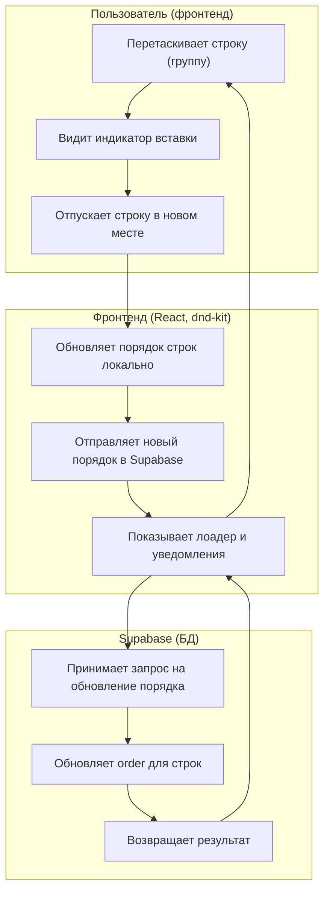

Дата: 05.09.2025 Добавлен модуль расширенных фильтров (логика, effector)

Описание: Реализована модель управления фильтрами в `src/features/AdvancedFilters` на базе effector. Добавлены события и стор для установки/удаления/очистки фильтров, инициализация из query string, а также невизуальный компонент синхронизации `FiltersSync` для автоматического отражения изменений фильтров в URL и обратной гидратации. Представление не изменено.

Дата: 05.09.2025 Рефактор модели фильтров на плоскую структуру

Описание: Переведено состояние фильтров на плоский вид без разделения на `hotel` и `room`. Обновлены типы (`AdvancedFiltersState`), константы (`INITIAL_FILTERS`), редьюсеры стора, парсинг/сериализация query string и компоненты `AdvancedFilters`, `AdvancedFiltersDemo`, `FiltersSync`. Теперь в сторе используются ключи секций: `city`, `features`, `accommodation`, `nutrition`, `beach`, `beachDistance`, `price`.

Дата: 05.09.2025 Добавлен Select для выбора города в HotelModal

Описание: Добавлен компонент Select из Shadcn UI для выбора города в форме создания/редактирования отеля. Создан компонент `src/components/ui/select.tsx` на базе Radix UI, обновлена схема валидации `HotelFormSchema` с полем `city`, исправлены конфликты имен между Consta UI и Shadcn UI Select компонентами.

Дата: 05.09.2025 Полная замена UI компонентов на Shadcn в HotelModal

Описание: Заменены все инпуты и селекты в `HotelInfo.tsx` на компоненты Shadcn UI. Созданы компоненты `Input`, `Textarea`, `Label` и обновлен `Select`. Удалены зависимости от Consta UI (`TextField`, `ConstaSelect`, `GridItem`). Обновлена логика работы с типами данных для совместимости с существующей схемой валидации. Установлены зависимости `@radix-ui/react-label` и `class-variance-authority`.

# Changelog

## [0.4.2] - 25.08.2025

### Создан компонент расширенной фильтрации для поиска номеров

**Описание:** Создан полнофункциональный компонент расширенной фильтрации для поиска номеров отелей с использованием shadcn/ui. Компонент предоставляет интуитивный интерфейс для фильтрации по различным критериям.

**Изменения:**

- Создан компонент `AdvancedFilters` с модальным окном фильтров
- Реализованы раскрывающиеся секции фильтров с помощью `Accordion`
- Добавлены интерактивные теги фильтров с возможностью активации/деактивации
- Создана система типизации для всех фильтров и их состояний
- Добавлены константы с данными для всех категорий фильтров
- Реализован демо-компонент для тестирования функциональности

**Категории фильтров:**

- **Фильтры по отелю:** Город (Сухум, Гагра, Гали, Пицунда, Новый Афон)
- **Фильтры по номеру:** Особенности номера, размещение, питание, пляж, расстояние до пляжа, цена
- **Особенности номера:** Вид на море, балкон, бассейн, тип комнаты, кухня, кондиционер
- **Размещение:** Разрешение на детей, разрешение на животных
- **Питание:** Завтрак, полупансион, полный пансион, кафе, без питания
- **Пляж:** Галечный, сосновый галечный, песчаный, галечно-песочный
- **Расстояние до пляжа:** Береговая зона, до 5/10 минут, более 10 минут
- **Цена:** Диапазоны от 3000 до 10000+ рублей

**Технические детали:**

- Использование shadcn/ui компонентов: Dialog, Accordion, Badge, Button
- Полная типизация TypeScript для всех интерфейсов
- Локальное управление состоянием фильтров
- Адаптивный дизайн с поддержкой мобильных устройств
- Анимации и плавные переходы для улучшения UX

**Структура файлов:**

```
src/features/AdvancedFilters/
├── ui/
│   ├── AdvancedFilters.tsx - Основной компонент
│   ├── FilterSection.tsx - Раскрывающаяся секция
│   ├── FilterTag.tsx - Тег фильтра
│   └── AdvancedFiltersDemo.tsx - Демо-компонент
├── lib/
│   ├── types.ts - Типы и интерфейсы
│   ├── constants.ts - Константы фильтров
│   └── api-planning.md - План интеграции с API
└── index.ts - Экспорты
```

## [0.4.1] - 25.08.2025

### Добавлена библиотека shadcn/ui

**Описание:** В проект добавлена библиотека shadcn/ui для создания современных UI компонентов. Библиотека интегрирована с существующими UI библиотеками (Ant Design и Consta UI) без замены существующих компонентов.

**Изменения:**

- Установлен и настроен Tailwind CSS v4 для поддержки shadcn/ui
- Добавлена библиотека shadcn/ui с последней версией
- Настроена конфигурация components.json для интеграции с проектом
- Создан файл utils.ts с утилитами для работы с классами
- Добавлены CSS переменные для темизации компонентов
- Настроена совместимость с существующей архитектурой проекта
- Добавлен базовый компонент Button для тестирования

**Технические детали:**

- Tailwind CSS настроен с поддержкой CSS переменных
- PostCSS конфигурация для обработки стилей
- Алиасы путей настроены для удобства импорта компонентов
- Поддержка темной и светлой темы через CSS переменные
- Интеграция с существующей структурой src/components/ui

**Преимущества:**

- Готовые к использованию современные UI компоненты
- Гибкая система темизации через CSS переменные
- Совместимость с существующими библиотеками
- Улучшенная типобезопасность компонентов
- Возможность постепенного перехода на shadcn/ui

## [0.4.0] - 27.07.2025

## Добавлен функционал изменения порядка строк (drag-and-drop)

**Описание:**
Реализована возможность интерактивного изменения порядка строк (групп) в календаре с помощью drag-and-drop. Новый порядок сохраняется в базе данных через Supabase. Пользователь видит визуальный индикатор вставки при перетаскивании, а изменения сразу отображаются в интерфейсе.

**Изменения:**

- Добавлены стили и индикаторы для визуализации вставки строки (InsertionIndicator)
- Обновлён компонент DraggableGroup для поддержки новых позиций
- Реализована поддержка двух состояний индикатора (before/after)
- Обновлён API для сохранения порядка строк через Supabase
- Добавлены уведомления об успехе и ошибках

**Диаграмма работы:**



**Преимущества:**

- Удобное изменение порядка строк без перезагрузки страницы
- Мгновенная обратная связь для пользователя
- Сохранение порядка строк на сервере (Supabase)
- Надёжная обработка ошибок и уведомления

## [0.3.4] - 13.07.2025

### Рефакторинг

- Выделена общая часть компонентов HotelCalendar и Calendar в базовый компонент BaseCalendar
- Упрощена архитектура календарных компонентов для лучшей поддерживаемости
- Добавлена возможность кастомизации рендеринга Timeline через renderTimeline пропс
- Улучшена типизация и структура кода

## [0.3.3] - 12.07.2025

### Добавлено

- Добавлена сортировка отелей в алфавитном порядке на главной странице
- Добавлена сортировка номеров отеля в алфавитном порядке на странице номеров

## [0.3.2] - 04.07.2025

### Изменено

- Изменена патч-версия в package.json
- Теперь бронирование отеля открывается в новой вкладке

## [0.3.0] - 23.06.2025

### Исправлено

- Добавлена виртуализация
- Улучшена логика фильтрации поиска: теперь onSearch не выполняется, если все значения фильтра не заданы
- Исправлена работа поиска по отелям, восстановлена корректная фильтрация
- Добавлена виртуализация для повышения производительности списка
- Удалено поле вместимости номера из фильтрации
- Проведена автоматическая правка кода (lint fix)

## [0.2.0] - 18.05.2025

### Добавлено

- Добавлена утилита для логирования в development режиме
- Добавлена поддержка z-index через CSS переменные
- Улучшена типизация для компонентов форм

### Исправлено

- Исправлена проблема с z-index в модальных окнах
- Исправлена валидация полей формы
- Исправлена обработка числовых значений в полях ввода

## [0.1.0] - 06.05.2025

### Добавлено

- Конвертация стилей в SCSS
    - Создан файл variables.scss с общими переменными и миксинами
    - Создан файл globals.scss с глобальными стилями
    - Конвертированы стили компонентов в SCSS
    - Добавлена поддержка вложенных правил и миксинов
    - Улучшена организация медиа-запросов

## 28.04.2025 Добавлен API для обновления порядка номеров

**Описание:** Добавлена функциональность для сохранения нового порядка номеров в базе данных через Supabase. Создан хук `useUpdateRoomOrder` для управления мутацией обновления порядка.

**Изменения:**

- Создана функция `updateRoomOrder` в `src/shared/api/room/room.ts`
- Добавлен хук `useUpdateRoomOrder` для управления мутацией
- Обновлены `Calendar.tsx` и `HotelCalendar.tsx` для использования нового API
- Добавлена инвалидация кеша после успешного обновления
- Добавлены уведомления об успешном обновлении и ошибках

**Технические детали:**

- Функция сначала сбрасывает `order_index` для всех номеров отеля
- Затем обновляет `order_index` для каждого номера в новом порядке
- Используется `upsert` для обновления записей с конфликтом по `id`
- Автоматическая инвалидация кеша для обновления UI
- Обработка ошибок с показом уведомлений пользователю

**Новые возможности:**

- Сохранение нового порядка номеров в базе данных
- Автоматическое обновление UI после изменения порядка
- Уведомления пользователя о статусе операции
- Обработка ошибок при обновлении

## 28.04.2025 Добавлена функциональность перетаскивания групп в календаре

**Описание:** Добавлена возможность перетаскивания групп (номеров отелей) в компонентах календаря с помощью библиотеки @dnd-kit. Каждый Timeline теперь имеет уникальный идентификатор, что позволяет использовать несколько календарей на одной странице без конфликтов.

**Изменения:**

- Установлены зависимости @dnd-kit/core, @dnd-kit/sortable, @dnd-kit/utilities
- Создан компонент `DraggableGroup` для отображения перетаскиваемых групп с иконкой
- Создан компонент `DndTimelineWrapper` для обертки Timeline в DnD зону
- Обновлен компонент `Timeline` для поддержки перетаскивания групп
- Добавлен `groupRenderer` для кастомизации отображения групп
- Обновлены `Calendar.tsx` и `HotelCalendar.tsx` для поддержки новой функциональности
- Добавлены стили для компонентов перетаскивания
- Каждый Timeline теперь имеет уникальный `timelineId` для изоляции зон перетаскивания

**Новые возможности:**

- Перетаскивание номеров отелей в рамках календаря
- Визуальная обратная связь при перетаскивании
- Уникальные идентификаторы для каждого Timeline
- Кастомизируемые стили для групп
- Поддержка множественных календарей на одной странице

**Технические детали:**

- Использование PointerSensor для активации перетаскивания
- Поддержка вертикального сортирования групп
- DragOverlay для визуального отображения перетаскиваемого элемента
- Обработка событий перетаскивания в родительских компонентах

## 28.04.2025 Вынесен компонент Timeline в отдельную папку

**Описание:** Компонент Timeline был вынесен из Calendar и HotelCalendar в отдельную папку `feature/BaseCalendar/ui/Timeline`. Это позволило избежать дублирования кода между двумя компонентами календаря и улучшить архитектуру проекта.

**Изменения:**

- Создан новый компонент `Timeline` в `src/features/BaseCalendar/ui/Timeline.tsx`
- Обновлен `Calendar.tsx` для использования нового компонента Timeline
- Обновлен `HotelCalendar.tsx` для использования нового компонента Timeline
- Создан файл стилей `src/features/BaseCalendar/ui/style.module.scss`
- Удален дублированный код из обоих компонентов календаря

**Преимущества:**

- Устранено дублирование кода между Calendar и HotelCalendar
- Улучшена поддерживаемость кода
- Упрощена архитектура проекта
- Компонент Timeline стал переиспользуемым

## 28.04.2025 Добавлена авторизация

**Описание:** Была добавлена авторизация, в приложении появилась форма авторизации, добавлены такие-то компоненты и краткое описание выполненных изменений.
