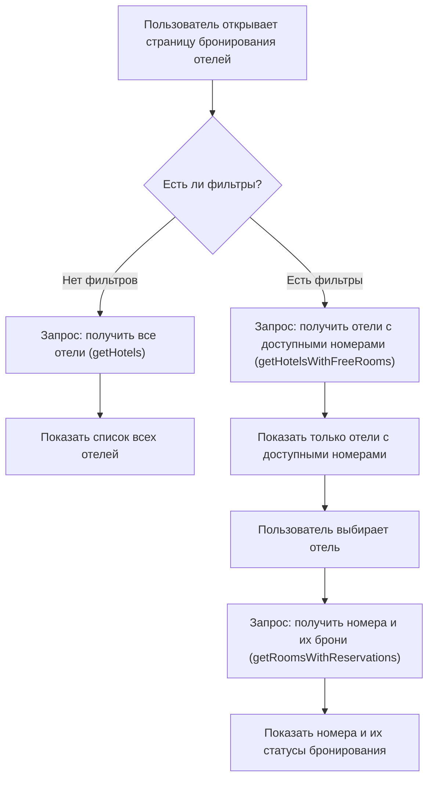

This is a [Next.js](https://nextjs.org) project bootstrapped with [`create-next-app`](https://nextjs.org/docs/app/api-reference/cli/create-next-app).

## Getting Started

First, run the development server:

```bash
npm run dev
# or
yarn dev
# or
pnpm dev
# or
bun dev
```

Open [http://localhost:3000](http://localhost:3000) with your browser to see the result.

You can start editing the page by modifying `app/page.tsx`. The page auto-updates as you edit the file.

This project uses [`next/font`](https://nextjs.org/docs/app/building-your-application/optimizing/fonts) to automatically optimize and load [Geist](https://vercel.com/font), a new font family for Vercel.

## Learn More

To learn more about Next.js, take a look at the following resources:

- [Next.js Documentation](https://nextjs.org/docs) - learn about Next.js features and API.
- [Learn Next.js](https://nextjs.org/learn) - an interactive Next.js tutorial.

You can check out [the Next.js GitHub repository](https://github.com/vercel/next.js) - your feedback and contributions are welcome!

## Deploy on Vercel

The easiest way to deploy your Next.js app is to use the [Vercel Platform](https://vercel.com/new?utm_medium=default-template&filter=next.js&utm_source=create-next-app&utm_campaign=create-next-app-readme) from the creators of Next.js.

Check out our [Next.js deployment documentation](https://nextjs.org/docs/app/building-your-application/deploying) for more details.

## Страницы приложения

### Главная

На главной странице отображается краткая информация о сервисе, преимущества и быстрый переход к поиску и бронированию отелей.

### Бронирование отелей

На странице бронирования отелей реализована гибкая система фильтрации и получения данных. Вся логика построена на разделении запросов:

- **Фильтрация**: если пользователь выбирает фильтры (категория, даты, количество гостей), выполняется запрос `getHotelsWithFreeRooms`, который возвращает только те отели, в которых есть свободные номера по заданным параметрам.
- **Без фильтров**: если фильтры не заданы, выполняется запрос `getHotels`, который возвращает все отели без учёта занятости номеров.
- **Получение номеров и броней**: при выборе конкретного отеля выполняется отдельный запрос `getRoomsWithReservations`, который возвращает список номеров этого отеля и их статусы бронирования на выбранные даты.

#### Диаграмма работы запросов



#### Особенности и нюансы

- Для фильтрации используются только явно заданные пользователем параметры. Если все параметры фильтра не заданы, запрос к базе возвращает полный список отелей.
- Запросы на получение отелей и получение номеров с бронями — разные и независимые, что позволяет оптимизировать загрузку данных и не перегружать интерфейс лишней информацией.
- Все данные возвращаются в виде структурированных объектов, что облегчает работу с ними на клиенте.
- При изменении фильтров страница автоматически обновляет список отелей без перезагрузки.

### Бронирование отеля

На странице бронирования конкретного отеля пользователь может выбрать номер, даты и оформить бронь. Все проверки на доступность выполняются в реальном времени.

### Отели

Страница со списком всех отелей, их описаниями, рейтингами и возможностью перейти к бронированию.
