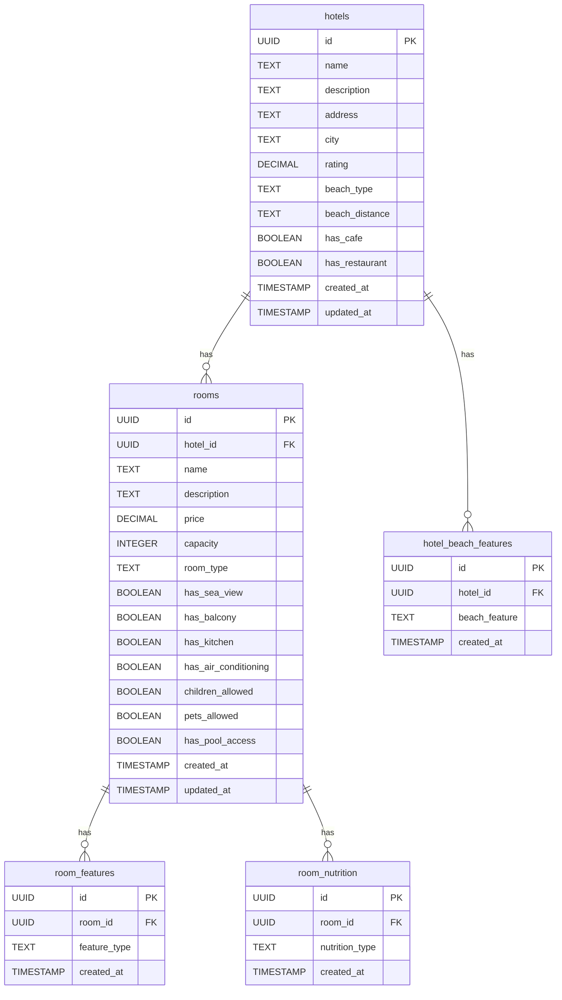

# План интеграции расширенных фильтров с API

## Обзор

Документ описывает план интеграции компонента расширенной фильтрации с существующей базой данных Supabase и API.

## Текущая структура базы данных

### Таблица `hotels`

```sql
CREATE TABLE hotels (
  id UUID PRIMARY KEY DEFAULT gen_random_uuid(),
  name TEXT NOT NULL,
  description TEXT,
  address TEXT,
  city TEXT, -- Существующее поле
  rating DECIMAL(3,2),
  created_at TIMESTAMP WITH TIME ZONE DEFAULT NOW(),
  updated_at TIMESTAMP WITH TIME ZONE DEFAULT NOW()
);
```

### Таблица `rooms`

```sql
CREATE TABLE rooms (
  id UUID PRIMARY KEY DEFAULT gen_random_uuid(),
  hotel_id UUID REFERENCES hotels(id) ON DELETE CASCADE,
  name TEXT NOT NULL,
  description TEXT,
  price DECIMAL(10,2),
  capacity INTEGER,
  created_at TIMESTAMP WITH TIME ZONE DEFAULT NOW(),
  updated_at TIMESTAMP WITH TIME ZONE DEFAULT NOW()
);
```

## Предлагаемые изменения в базе данных

### 1. Расширение таблицы `hotels`

```sql
-- Добавить новые поля для фильтрации по отелю
ALTER TABLE hotels ADD COLUMN IF NOT EXISTS beach_type TEXT CHECK (beach_type IN ('pebble', 'pine-pebble', 'sand', 'pebble-sand'));
ALTER TABLE hotels ADD COLUMN IF NOT EXISTS beach_distance TEXT CHECK (beach_distance IN ('coastal-zone', '5-min', '10-min', 'more-10-min'));
ALTER TABLE hotels ADD COLUMN IF NOT EXISTS has_cafe BOOLEAN DEFAULT FALSE;
ALTER TABLE hotels ADD COLUMN IF NOT EXISTS has_restaurant BOOLEAN DEFAULT FALSE;
```

### 2. Расширение таблицы `rooms`

```sql
-- Добавить новые поля для фильтрации по номеру
ALTER TABLE rooms ADD COLUMN IF NOT EXISTS room_type TEXT CHECK (room_type IN ('single-room', 'double-room'));
ALTER TABLE rooms ADD COLUMN IF NOT EXISTS has_sea_view BOOLEAN DEFAULT FALSE;
ALTER TABLE rooms ADD COLUMN IF NOT EXISTS has_balcony BOOLEAN DEFAULT FALSE;
ALTER TABLE rooms ADD COLUMN IF NOT EXISTS has_kitchen BOOLEAN DEFAULT FALSE;
ALTER TABLE rooms ADD COLUMN IF NOT EXISTS has_air_conditioning BOOLEAN DEFAULT FALSE;
ALTER TABLE rooms ADD COLUMN IF NOT EXISTS children_allowed BOOLEAN DEFAULT TRUE;
ALTER TABLE rooms ADD COLUMN IF NOT EXISTS pets_allowed BOOLEAN DEFAULT FALSE;
ALTER TABLE rooms ADD COLUMN IF NOT EXISTS has_pool_access BOOLEAN DEFAULT FALSE;
```

### 3. Новая таблица `room_features`

```sql
-- Таблица для связи номеров с особенностями
CREATE TABLE room_features (
  id UUID PRIMARY KEY DEFAULT gen_random_uuid(),
  room_id UUID REFERENCES rooms(id) ON DELETE CASCADE,
  feature_type TEXT NOT NULL CHECK (feature_type IN ('sea-view', 'balcony', 'pool', 'kitchen', 'air-conditioning')),
  created_at TIMESTAMP WITH TIME ZONE DEFAULT NOW()
);

CREATE INDEX idx_room_features_room_id ON room_features(room_id);
CREATE INDEX idx_room_features_type ON room_features(feature_type);
```

### 4. Новая таблица `room_nutrition`

```sql
-- Таблица для связи номеров с типами питания
CREATE TABLE room_nutrition (
  id UUID PRIMARY KEY DEFAULT gen_random_uuid(),
  room_id UUID REFERENCES rooms(id) ON DELETE CASCADE,
  nutrition_type TEXT NOT NULL CHECK (nutrition_type IN ('breakfast', 'half-board', 'full-board', 'no-meals')),
  created_at TIMESTAMP WITH TIME ZONE DEFAULT NOW()
);

CREATE INDEX idx_room_nutrition_room_id ON room_nutrition(room_id);
CREATE INDEX idx_room_nutrition_type ON room_nutrition(nutrition_type);
```

### 5. Новая таблица `hotel_beach_features`

```sql
-- Таблица для связи отелей с особенностями пляжа
CREATE TABLE hotel_beach_features (
  id UUID PRIMARY KEY DEFAULT gen_random_uuid(),
  hotel_id UUID REFERENCES hotels(id) ON DELETE CASCADE,
  beach_feature TEXT NOT NULL CHECK (beach_feature IN ('pebble', 'pine-pebble', 'sand', 'pebble-sand')),
  created_at TIMESTAMP WITH TIME ZONE DEFAULT NOW()
);

CREATE INDEX idx_hotel_beach_features_hotel_id ON hotel_beach_features(hotel_id);
CREATE INDEX idx_hotel_beach_features_feature ON hotel_beach_features(beach_feature);
```

## API Endpoints

### 1. Получение отфильтрованных номеров

```typescript
// GET /api/rooms/filtered
interface FilteredRoomsRequest {
    city?: string[];
    beach_type?: string[];
    beach_distance?: string[];
    room_type?: string[];
    features?: string[];
    accommodation?: string[];
    nutrition?: string[];
    price_range?: {
        min?: number;
        max?: number;
    };
    has_cafe?: boolean;
    has_restaurant?: boolean;
}

interface FilteredRoomsResponse {
    rooms: RoomWithHotel[];
    total: number;
    filters: AppliedFilters;
}
```

### 2. Получение доступных фильтров

```typescript
// GET /api/filters/available
interface AvailableFiltersResponse {
    cities: string[];
    beach_types: string[];
    beach_distances: string[];
    room_types: string[];
    features: string[];
    accommodation_options: string[];
    nutrition_types: string[];
    price_ranges: PriceRange[];
}
```

## Реализация фильтрации

### 1. SQL запрос для фильтрации

```sql
WITH filtered_hotels AS (
  SELECT DISTINCT h.id
  FROM hotels h
  LEFT JOIN hotel_beach_features hbf ON h.id = hbf.hotel_id
  WHERE
    (h.city = ANY($1) OR $1 IS NULL)
    AND (h.beach_type = ANY($2) OR $2 IS NULL)
    AND (h.beach_distance = ANY($3) OR $3 IS NULL)
    AND (h.has_cafe = $4 OR $4 IS NULL)
    AND (h.has_restaurant = $5 OR $5 IS NULL)
),
filtered_rooms AS (
  SELECT DISTINCT r.id
  FROM rooms r
  JOIN filtered_hotels fh ON r.hotel_id = fh.id
  LEFT JOIN room_features rf ON r.id = rf.room_id
  LEFT JOIN room_nutrition rn ON r.id = rn.room_id
  WHERE
    (r.room_type = ANY($6) OR $6 IS NULL)
    AND (r.has_sea_view = $7 OR $7 IS NULL)
    AND (r.has_balcony = $8 OR $8 IS NULL)
    AND (r.has_kitchen = $9 OR $9 IS NULL)
    AND (r.has_air_conditioning = $10 OR $10 IS NULL)
    AND (r.children_allowed = $11 OR $11 IS NULL)
    AND (r.pets_allowed = $12 OR $12 IS NULL)
    AND (r.has_pool_access = $13 OR $13 IS NULL)
    AND (r.price BETWEEN $14 AND $15)
)
SELECT r.*, h.*
FROM filtered_rooms fr
JOIN rooms r ON fr.id = r.id
JOIN hotels h ON r.hotel_id = h.id;
```

### 2. TypeScript типы для API

```typescript
// src/shared/api/rooms/types.ts
export interface RoomFilters {
    city?: string[];
    beachType?: string[];
    beachDistance?: string[];
    roomType?: string[];
    features?: string[];
    accommodation?: string[];
    nutrition?: string[];
    priceRange?: {
        min?: number;
        max?: number;
    };
    hasCafe?: boolean;
    hasRestaurant?: boolean;
}

export interface FilteredRoomsParams {
    filters: RoomFilters;
    page?: number;
    limit?: number;
    sortBy?: string;
    sortOrder?: 'asc' | 'desc';
}
```

## Интеграция с существующим кодом

### 1. Обновление API функций

```typescript
// src/shared/api/rooms/rooms.ts
export const getFilteredRooms = async (params: FilteredRoomsParams): Promise<Room[]> => {
    const { data, error } = await supabase
        .from('rooms')
        .select(
            `
      *,
      hotels (
        *,
        hotel_beach_features (*)
      ),
      room_features (*),
      room_nutrition (*)
    `,
        )
        .applyFilters(params.filters);

    if (error) throw error;
    return data;
};
```

### 2. Хук для фильтрации

```typescript
// src/features/AdvancedFilters/hooks/useFilteredRooms.ts
export const useFilteredRooms = (filters: AdvancedFiltersState) => {
    return useQuery({
        queryKey: ['filtered-rooms', filters],
        queryFn: () => getFilteredRooms({ filters: convertFiltersToAPI(filters) }),
        enabled: hasActiveFilters(filters),
    });
};
```

## Миграция данных

### 1. Скрипт миграции

```sql
-- Миграция существующих данных
UPDATE hotels
SET beach_type = 'pebble'
WHERE beach_type IS NULL;

UPDATE rooms
SET room_type = 'single-room'
WHERE room_type IS NULL;

-- Заполнение таблиц связей на основе существующих данных
INSERT INTO room_features (room_id, feature_type)
SELECT id, 'air-conditioning'
FROM rooms
WHERE has_air_conditioning = true;
```

## Диаграмма базы данных



## Следующие шаги

1. **Создание миграций** - написать SQL скрипты для изменения структуры БД
2. **Обновление API** - добавить новые endpoints и функции фильтрации
3. **Интеграция компонента** - подключить AdvancedFilters к существующему поиску
4. **Тестирование** - проверить работу фильтров на реальных данных
5. **Оптимизация** - добавить индексы и кеширование для улучшения производительности

