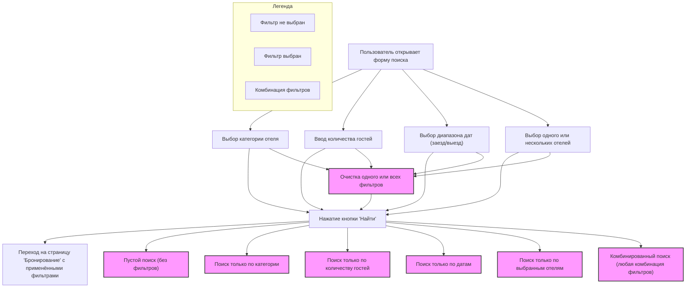

# Сценарии использования фильтров поиска на странице "Бронирование"

## Описание

Данная форма поиска позволяет пользователю подобрать отели по различным фильтрам:

- Категория отеля
- Количество гостей
- Диапазон дат (заезд/выезд)
- Название/выбор одного или нескольких отелей

Пользователь может комбинировать фильтры в любом порядке, а также очищать их. После нажатия кнопки "Найти" происходит
переход на страницу "Бронирование" с применёнными фильтрами.

## Возможные сценарии использования

1. **Пустой поиск** (без выбора фильтров)
2. **Поиск только по категории**
3. **Поиск только по количеству гостей**
4. **Поиск только по диапазону дат** (работает только при выборе обеих дат)
5. **Поиск только по выбранным отелям**
6. **Комбинированный поиск** (любая комбинация фильтров: категория + даты, категория + количество гостей, даты + отели и
   т.д.)
7. **Очистка одного или всех фильтров** (сброс значений и повторный поиск)

## Диаграмма сценариев (Mermaid)

---

**Каждый из этих сценариев должен быть покрыт ручными и/или автоматизированными тестами.**

- Все фильтры могут комбинироваться между собой.
- После очистки фильтра возможен повторный поиск.
- Диапазон дат работает только при выборе обеих дат.
- При любом изменении фильтра возможен повторный поиск.

## Подробно: Комбинированный поиск

Пользователь может выбрать любые два, три или все четыре фильтра одновременно. Вот все возможные комбинации:

### 1. Два фильтра

- Категория + Количество гостей

  - **Пример:**
    - Категория: "Отель"
    - Количество гостей: 2
  - **Ожидаемый результат:**
    - Найдены все отели категории "Отель", в которых есть номера, подходящие для 2 гостей, без учёта дат и названий.

- Категория + Даты

  - **Пример:**
    - Категория: "Апартаменты"
    - Даты: 10.05.2025 – 15.05.2025
  - **Ожидаемый результат:**
    - Найдены все апартаменты, в которых есть свободные номера на выбранные даты, без учёта количества гостей и
      названий.

- Категория + Отели

  - **Пример:**
    - Категория: "Хостел"
    - Отели: "Хостел №1", "Хостел №2"
  - **Ожидаемый результат:**
    - Найдены только выбранные хостелы, если они соответствуют категории "Хостел".

- Количество гостей + Даты

  - **Пример:**
    - Количество гостей: 3
    - Даты: 01.06.2025 – 05.06.2025
  - **Ожидаемый результат:**
    - Найдены все отели, где есть свободные номера на эти даты, подходящие для 3 гостей, без учёта категории и названия.

- Количество гостей + Отели

  - **Пример:**
    - Количество гостей: 1
    - Отели: "Гостиница Москва"
  - **Ожидаемый результат:**
    - Найдена только "Гостиница Москва", если в ней есть номера для 1 гостя, без учёта категории и дат.

- Даты + Отели
  - **Пример:**
    - Даты: 20.07.2025 – 25.07.2025
    - Отели: "Отель Север", "Отель Юг"
  - **Ожидаемый результат:**
    - Найдены только выбранные отели, если в них есть свободные номера на указанные даты, без учёта категории и
      количества гостей.

### 2. Три фильтра

- Категория + Количество гостей + Даты

  - **Пример:**
    - Категория: "Гостиница"
    - Количество гостей: 2
    - Даты: 05.08.2025 – 10.08.2025
  - **Ожидаемый результат:**
    - Найдены все гостиницы, где есть свободные номера на эти даты для 2 гостей, без учёта названия.

- Категория + Количество гостей + Отели

  - **Пример:**
    - Категория: "Апартаменты"
    - Количество гостей: 4
    - Отели: "Апарт-отель Лето"
  - **Ожидаемый результат:**
    - Найден только "Апарт-отель Лето", если он относится к категории "Апартаменты" и в нём есть номера для 4 гостей,
      без учёта дат.

- Категория + Даты + Отели

  - **Пример:**
    - Категория: "Отель"
    - Даты: 12.09.2025 – 15.09.2025
    - Отели: "Отель Премиум"
  - **Ожидаемый результат:**
    - Найден только "Отель Премиум", если он относится к категории "Отель" и в нём есть свободные номера на указанные
      даты, без учёта количества гостей.

- Количество гостей + Даты + Отели
  - **Пример:**
    - Количество гостей: 2
    - Даты: 01.10.2025 – 05.10.2025
    - Отели: "Гостиница Центр"
  - **Ожидаемый результат:**
    - Найдена только "Гостиница Центр", если в ней есть свободные номера на эти даты для 2 гостей, без учёта категории.

### 3. Все фильтры

- Категория + Количество гостей + Даты + Отели
  - **Пример:**
    - Категория: "Хостел"
    - Количество гостей: 1
    - Даты: 15.11.2025 – 20.11.2025
    - Отели: "Хостел Дружба"
  - **Ожидаемый результат:**
    - Найден только "Хостел Дружба", если он относится к категории "Хостел" и в нём есть свободные номера на указанные
      даты для 1 гостя.

### Тестирование 07.07.25

- При тестирование "просыпался" сценарии повторного поиска при том же самом фильтре
